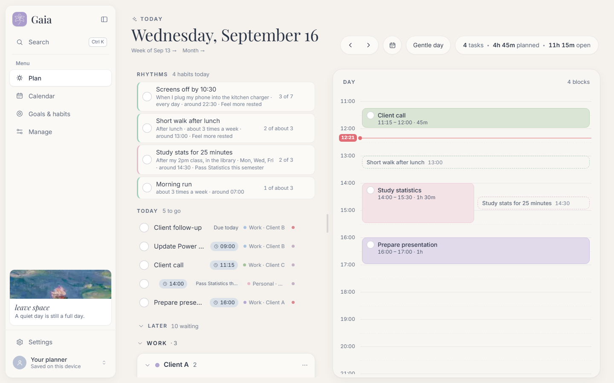
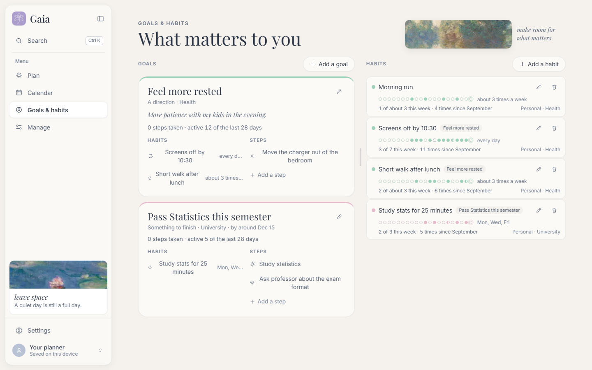
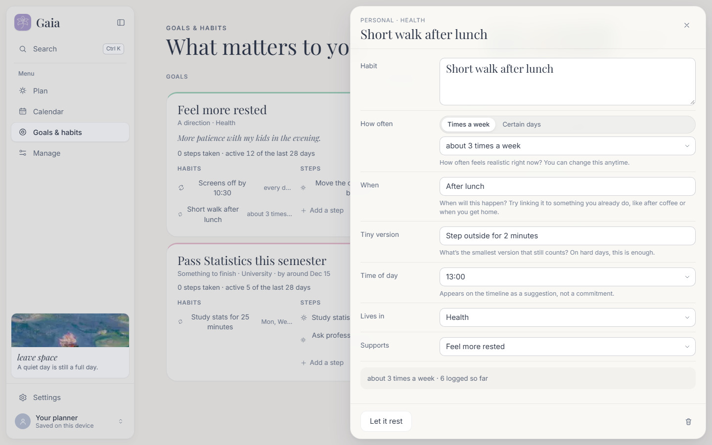
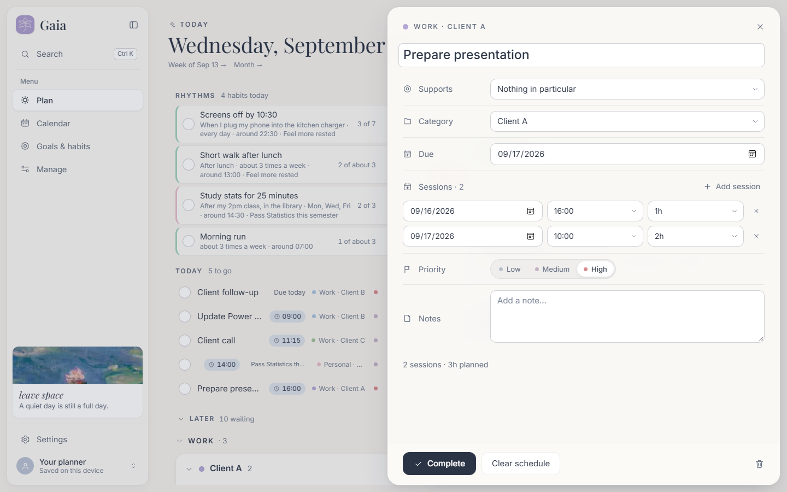
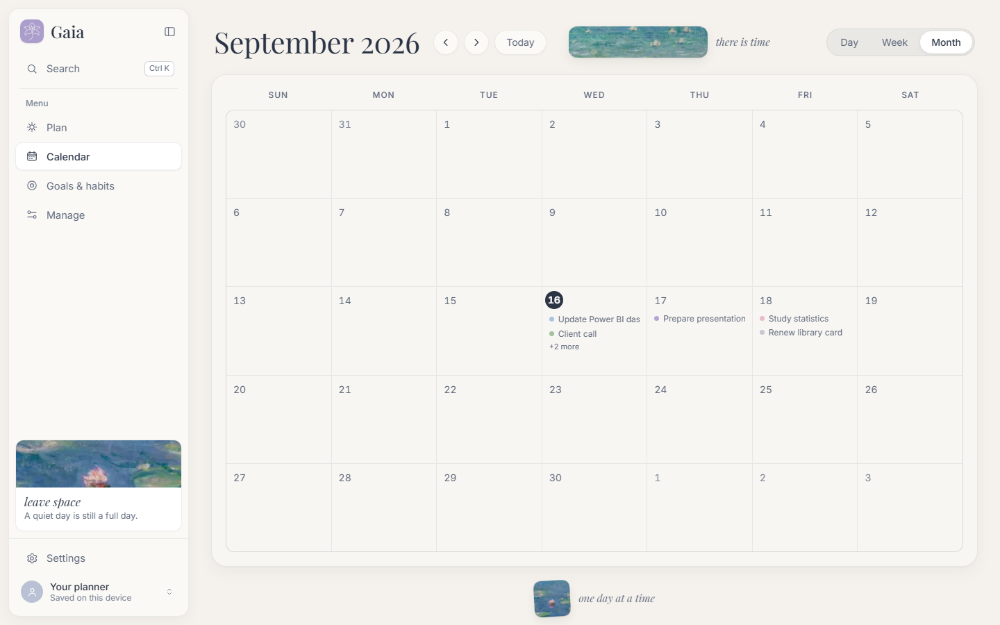
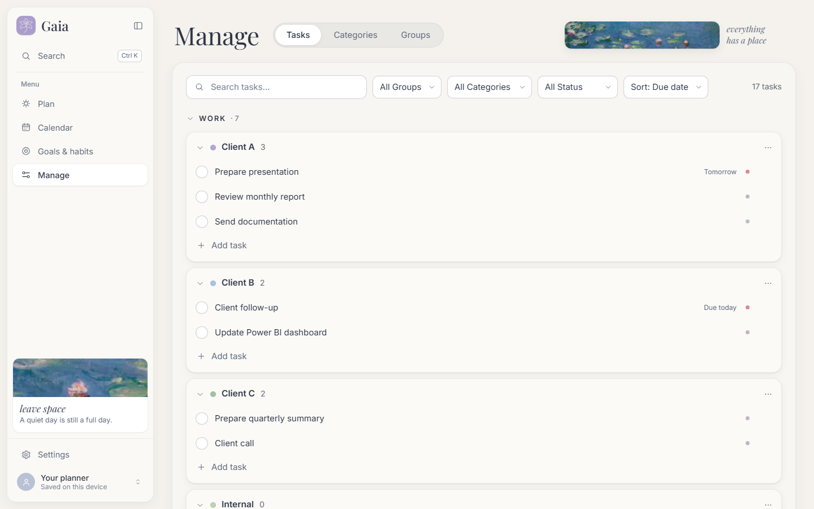
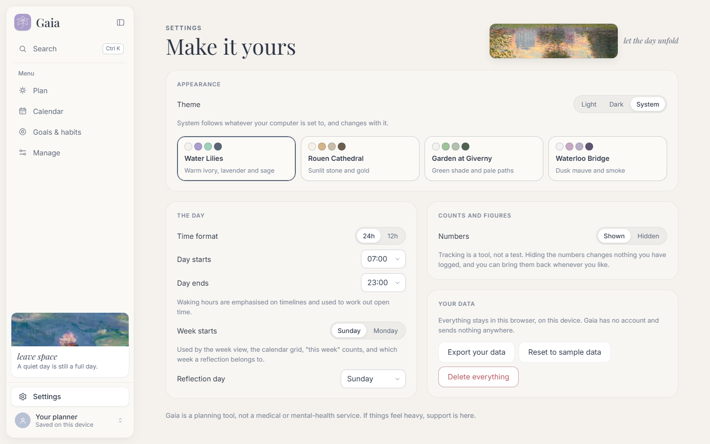
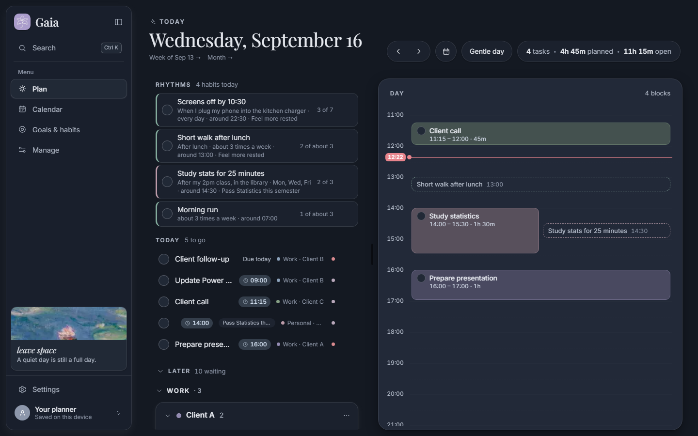
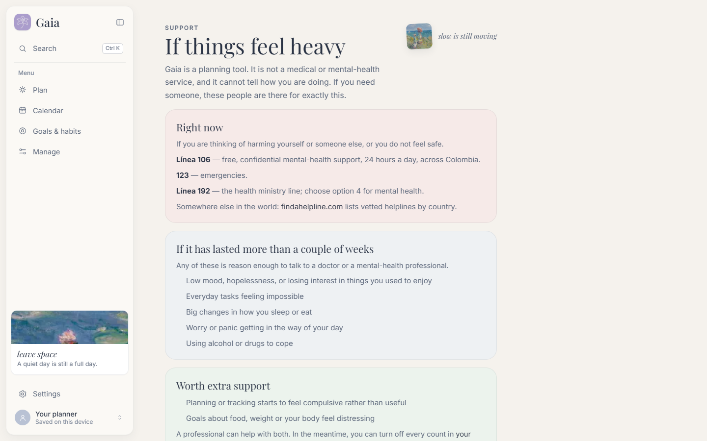

<p align="center">
  
</p>

<h1 align="center">Gaia</h1>

<p align="center">
  <em>a kind way to organise yourself</em><br />
  <sub>tasks · time-blocking · goals · gentle habits</sub>
</p>

<p align="center">
  
</p>

<p align="center">
  <a href="#why-gaia-exists">Why</a> ·
  <a href="#a-little-tour">Tour</a> ·
  <a href="#run-it">Run it</a> ·
  <a href="docs/index.html">Docs page</a> ·
  <a href="#for-developers">For developers</a>
</p>

---

##  Why Gaia exists

Most planners are built like scoreboards. Red numbers for what you didn't do,
streaks that break, lists that grow every day you look at them. They measure
you, and on a hard week they tell you that you failed.

**Gaia is an attempt at the opposite:** a planner that turns *toxic
productivity* into something softer. It helps you choose a day, not survive
one. It remembers what you did, and never counts what you didn't.

> *A quiet day is still a full day.*

Gaia is named after the Greek goddess of the Earth, the one who holds
everything without hurrying any of it. The app is painted in the colours of
Claude Monet's gardens for the same reason: organising your life should feel
more like tending a garden than clearing an inbox.

### What that means in practice

| Toxic productivity says… | Gaia says… |
|---|---|
| Your unfinished tasks follow you forever. |  **A day is chosen, not inherited.** Only what you pick for today shows up today. |
| You broke your 12-day streak. |  **There are no streaks.** Habits have a rhythm ("about 3 times a week"), and a blank day is just blank. |
| Mark it *done* or it counts as *failed*. |  **You can log *done*, *tiny*, or *rest*.** The small version on a hard day still counts. |
| Delete it or let it rot on the list. |  **Letting go is a real option.** Tasks can be let go and goals released, with their history kept. |
| Every empty hour is wasted time. |  **Rest is not empty time.** Gaia calls it *open time*, and quietly mentions a very full day once. |
| Here are your numbers. |  **Numbers are optional.** One setting hides every count without touching what you logged. |

Gaia never uses the words *missed*, *overdue*, *failed* or *streak*. That is a
rule in the code, not just a style choice.

---

##  A little tour

In the app, **your planner ▸ Walk through it together** offers the same tour as
six short stops on the real page. It never starts on its own, and leaving it
halfway is a perfectly good ending.

###  Plan: your day, chosen gently

Today's rhythms, the few things you picked for today, and a folded *Later* list
for everything else. The timeline beside it is where you give tasks a place.

<p align="center"></p>

###  Goals & habits: what matters to you

A goal is a direction, not a deadline. Each habit has a cue, a flexible rhythm,
and a tiny version for the days when that is all there is.

<p align="center"></p>

<table>
  <tr>
    <td width="50%"></td>
    <td width="50%"></td>
  </tr>
  <tr>
    <td align="center"><sub><em>“What's the smallest version that still counts?”</em></sub></td>
    <td align="center"><sub>A task can be worked on across several sessions</sub></td>
  </tr>
</table>

###  Calendar and Manage

<table>
  <tr>
    <td width="50%"></td>
    <td width="50%"></td>
  </tr>
  <tr>
    <td align="center"><sub>Day, week and month views of the same time blocks</sub></td>
    <td align="center"><sub>The workshop: tasks, categories and groups</sub></td>
  </tr>
</table>

###  Make it yours

Light, dark, or whatever your computer prefers, in four palettes taken from
Monet: **Water Lilies**, **Rouen Cathedral**, **Garden at Giverny** and
**Waterloo Bridge**.

<table>
  <tr>
    <td width="50%"></td>
    <td width="50%"></td>
  </tr>
  <tr>
    <td align="center"><sub><em>“Tracking is a tool, not a test.”</em></sub></td>
    <td align="center"><sub>The same calm, after dark</sub></td>
  </tr>
</table>

###  Support

<p align="center"></p>

Gaia is a planning tool, not a health service. If things feel heavy, the
Support page lists crisis and mental-health resources in Colombia and
internationally.

---

##  Run it

**Easiest:** double-click **Gaia** on your desktop (or `Start Gaia.bat` in this
folder). It installs what it needs the first time, starts the app, and opens it
in your browser. Keep the small terminal window open while you use Gaia; close
it to stop.

**From a terminal:**

```bash
npm install
npm run dev
```

Then open http://localhost:5173. Requires [Node.js](https://nodejs.org) 18 or newer.

###  Your data

Run on your own computer, Gaia works entirely in your browser: there is no
account, nothing is uploaded, and your planner is saved in `localStorage` (key
`gaia:v1`) on the device you use it on. Clearing your browser data erases it.

Put online (see [Accounts and Vercel](#accounts-and-vercel)), everyone signs in
and gets their own planner, kept in the `planners` table in Supabase with a copy
in the browser (`gaia:v1:<user id>`) so Gaia still opens offline; edits made
offline are sent once the connection is back.

Either way, **Settings ▸ Your data** can export everything as JSON, import such
a file, restore the sample data, or delete the lot (with one undo). A group you
link to an Outlook calendar sends its scheduled tasks there.

---

##  For developers

A friendlier, illustrated version of this section lives in
[`docs/index.html`](docs/index.html). Open it in any browser.

### How things relate

```
Group  →  Category  →  Task          the hierarchy: where something belongs
                        ↑
Goal  →  Habits + Tasks              an optional lens: what something is for
```

A goal is never a folder. Tasks and habits belong to a category, and may
*additionally* point at one goal. Most things never will, and that is fine.

### Commands

| Command | What it does |
|---|---|
| `npm run dev` | Starts the dev server on port 5173 |
| `npm test` | Runs the unit tests |
| `npm run build` | Type-checks and builds a production version into `dist/` |
| `npm run art` | Regenerates the Monet crops and the logo/icon files |
| `node scripts/build-docs-assets.mjs` | Rebuilds the painting strips and icons used by the README and docs page |
| `node scripts/gen-tokens.mjs` | Regenerates `src/styles/tokens.css` from the palette definitions |

### How the code is laid out

```
src/
  types.ts            every entity: Group, Category, Task, Goal, Habit, CheckIn, Reflection
  store/
    reducer.ts        one switch, one action per change, no side effects
    selectors.ts      plain read functions (partitionDay, habitsForDate, weekCount…)
    persist.ts        localStorage, plus migrateState for saves from older versions
    cloud.ts          saving each account's planner to Supabase
    GaiaProvider.tsx  state, toasts, undo, and the theme stamped on <html>
  auth/               Gaia accounts (AuthGate, Supabase) and Microsoft sign-in
  integrations/       the Outlook calendar link
  lib/                pure helpers: dates, time, layout, rhythm, copy, sensitive
  components/         ui kit, tasks, habits, plan sections, timeline, sheets, layout
  pages/              Plan (TodayPage), Calendar, Goals, Settings, Support, Manage/*
  styles/             tokens.css (all colour) and global.css
docs/
  index.html          the illustrated docs page
  screenshots/        the images in this README
  assets/             painting strips and icons (node scripts/build-docs-assets.mjs)
```

### Conventions that keep Gaia kind

- **Copy rules.** Never "missed", "overdue", "failed" or "streak".
  `src/lib/copy.ts` holds the shared wording.
- **Check-ins only ever store something positive or neutral.** If you add a
  feature here, keep it that way.
- **Colour only comes from tokens.** No component names a colour, which is what
  makes a new palette a short block in `tokens.css` instead of a rewrite.
  Regenerate it with `node scripts/gen-tokens.mjs` after editing the palettes.
- **Editors are side sheets addressed by the URL** (`?task=`, `?goal=`,
  `?habit=`), so the Back button closes them. Only one can be open at a time.
- **No form submits.** Every control in an editor writes as it changes.
- **Undo works by snapshotting the whole state** before a destructive action and
  passing it to `notify(message, previous)`.
- **Old saves still load.** `migrateState` fills in anything that did not exist
  when they were written, and existing data always wins.

### Accounts and Vercel

Sign-in and cloud saving use [Supabase](https://supabase.com) (email and
password). They switch on when `VITE_SUPABASE_URL` and `VITE_SUPABASE_ANON_KEY`
are set; without them Gaia runs as before, with no sign-in.

1. **Supabase:** create a project. In *SQL Editor*, run `supabase/schema.sql`.
   From *Project Settings ▸ API*, copy the project URL and the `anon` public
   key. Its row-level security is what keeps each planner private, so the key
   is safe to ship in the app.
2. **Vercel:** *Add New ▸ Project*, import this GitHub repo (Vercel reads
   `vercel.json`). Under *Environment Variables* add the two values above, plus
   `VITE_MS_CLIENT_ID` / `VITE_MS_TENANT_ID` if you use Outlook, then deploy.
3. **Back in Supabase**, *Authentication ▸ URL Configuration*: set *Site URL*
   to your Vercel address (e.g. `https://gaia-xyz.vercel.app`) and add it under
   *Redirect URLs*, so confirmation and password-reset emails link back to it.
4. **Outlook, if used:** add `https://<your vercel address>/auth-redirect.html`
   as another *Single-page application* redirect URI in the Entra app.

The first time someone signs in, if that browser already holds a planner from
before accounts (`gaia:v1`), Gaia asks whether to use it for the account or
start with the sample data. To bring over a planner from another address (such
as `localhost` to Vercel): Settings ▸ Export your data there, then Settings ▸
Import from a file on the site once you have signed in.

Environment variable changes only take effect after a new deploy.
`.env.example` lists them all.

### Microsoft sign-in

Settings ▸ Microsoft account signs in with a work or school account
(`User.Read`, `Calendars.ReadWrite`). Then, in Manage ▸ Groups & categories, the calendar
button on a group links it to one of your Outlook calendars:

- that calendar's meetings appear on the Plan timeline and in Calendar, in the
  group's colour, read-only (all-day events are not shown);
- the group's time blocks from today on are created there as events, and kept
  up to date when they move, change, or are removed. Unlinking removes them.

Changes made to those events in Outlook are not copied back. What Gaia has put
in Outlook is tracked in `localStorage` under `gaia:outlook:<account>`.

To turn it on, register an app once in the
[Microsoft Entra admin center](https://entra.microsoft.com) (App registrations
▸ New registration):

1. **Supported account types:** accounts in this organizational directory only.
2. **Redirect URI:** platform *Single-page application*,
   `http://localhost:5173/auth-redirect.html`.
3. Copy the *Application (client) ID* and *Directory (tenant) ID* into
   `.env.local` in this folder, then restart Gaia:

```
VITE_MS_CLIENT_ID=<application id>
VITE_MS_TENANT_ID=<directory id>
```

`.env.local` is git-ignored. If your organization blocks users from registering
apps or consenting to them, an IT admin has to do step 1 or grant consent.

### The paintings

Originals live in `monet/` and are never bundled. `npm run art` cuts small
`.webp` crops into `src/assets/monet/`, which is what the app imports. To add a
painting, drop it in `monet/`, add a crop to the list in
`scripts/crop-monet.mjs`, run `npm run art`, and register it in
`src/components/art/MonetAccent.tsx`.

## License

The code is released under the [Apache License 2.0 with the Commons Clause](LICENSE).
You may use, study, change and share it, forks included, but you may not sell
it: no paid product, hosted service or support offering whose value comes
mainly from Gaia. The Monet paintings are public domain and are not covered by
it.

---

<p align="center">
  <br />
  <sub>All paintings by Claude Monet, public domain.</sub><br />
  <em>leave space · let the day unfold · make room for what matters</em>
</p>
